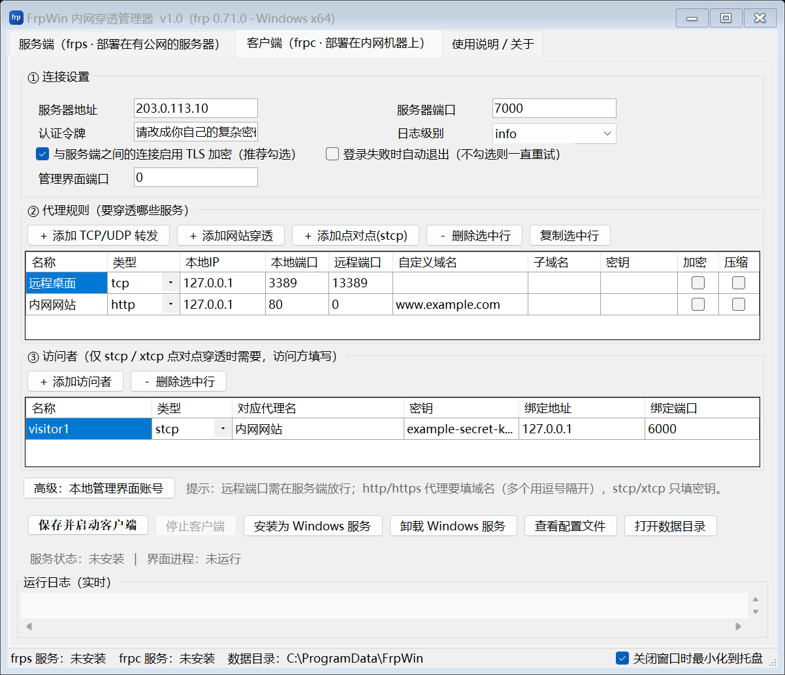

# FrpWin · Windows 内网穿透图形管理器

把 [frp](https://github.com/fatedier/frp) 包装成 Windows 原生程序的一套工具：
一个全中文的图形管理器 + 一键安装包，装完桌面就有快捷方式，不用再手写 TOML 配置。

> 本项目是 frp 的 Windows 图形外壳，**不含 frp 源码**。
> `frps.exe` / `frpc.exe` 由脚本从 frp 官方源码编译生成。



---

## 功能

- **全中文图形界面**，双标签页分别管理服务端和客户端，配置不用手写
- **支持 tcp / udp / http / https / stcp / xtcp 六种代理**，以及 stcp/xtcp 的 visitor
- **一键注册 Windows 服务**：`FrpWin.exe --service frps|frpc` 作为服务宿主守护 frp 子进程，
  支持开机自启、崩溃自动重启
- **一键放行 Windows 防火墙**：把界面上填的端口一次性加进防火墙
- **实时日志**：图形界面里滚动显示；服务模式下按 8 MB 自动轮转
- **内置 frp 官方 Web 管理面板**：编译时把 Vue 前端打进二进制，
  服务端开 `webServer.port` 就能用浏览器看实时连接和流量
- **单实例保护**：重复启动会把已有窗口拉到前台，不会开出一堆窗口
- **界面布局自检**：内置 `--dump-layout` / `--screenshot`，配套自动化测试断言
  「按钮不截断、表头不截断、控件不重叠、默认窗口不用滚动」

---

## 快速开始

直接用安装包

到 [Releases](../../releases) 下载 `setup.exe`，双击安装。

- 安装到 `C:\Program Files\FrpWin\`
- 桌面生成快捷方式「FrpWin 内网穿透套装」
- 数据目录 `C:\ProgramData\FrpWin\`（配置文件与日志，卸载时保留）
- 支持 `/CURRENTUSER` 参数安装到当前用户目录（不需要管理员权限）

### 五分钟跑通

1. **服务器**（有公网 IP 的机器）：打开 FrpWin → 「服务端」标签页 →
   设置 token → 「保存并启动服务端」→「放行防火墙端口」→「安装为 Windows 服务」
2. **内网机器**：打开 FrpWin → 「客户端」标签页 →
   填服务器公网 IP 和端口，token 与服务端一致 → 在「代理规则」里加一条
   （例如 `tcp` 类型、本地端口 `3389`、远程端口 `13389`）→「保存并启动客户端」
3. 在任何地方远程桌面连接 `服务器公网IP:13389` 即可

详细说明见 [`docs/使用说明.txt`](docs/使用说明.txt)。

---

## 从源码构建

### 环境要求

| 用途 | 需要 |
|---|---|
| 编译图形管理器 | .NET SDK 6 或更高（Windows） |
| 编译 frp | Go 1.25+ |
| 构建 frp Web 管理面板 | Node.js 18+ |
| 打包安装程序 | [Inno Setup 6](https://jrsoftware.org/isdl.php) |
| 运行脚本 | Windows PowerShell 5.1（系统自带） |

### 构建步骤

产物在 `dist\`：
```
dist/
├── setup.exe                安装程序
├── 使用说明.txt
├── SHA256校验值.txt
└── 绿色免安装版/
    ├── FrpWin.exe
    ├── frps.exe
    ├── frpc.exe
    └── conf/                示例配置
```

只想编译图形管理器、不打安装包：

```powershell
.\scripts\build.ps1 -SkipInstaller
```

`fetch-frp.ps1` 的参数：

| 参数 | 作用 |
|---|---|
| `-Force` | 已下载/已编译过也重新来一遍 |
| `-SkipWeb` | 跳过前端构建（`frps` 将没有 Dashboard 页面，但体积小、不需要 Node） |
| `-GoProxy <url>` | 换 Go 模块代理，默认 `https://goproxy.cn,direct` |
| `-SourceUrl <url>` | 自定义 frp 源码包地址（默认会依次尝试 codeload / github / 加速代理） |

> **关于安装包的中文界面**
> Inno Setup 自带的语言文件里没有简体中文。想要中文安装向导，请下载
> [ChineseSimplified.isl](https://github.com/kira-96/Inno-Setup-Chinese-Simplified-Translation)
> 放到 `<Inno Setup 安装目录>\Languages\` 下。
> 没放也没关系 —— 脚本会自动只编译英文版安装程序，不会构建失败。

---

## 命令行参数

`FrpWin.exe` 除了双击打开图形界面，还支持：

| 参数 | 作用 |
|---|---|
| `--service frps\|frpc` | 作为 Windows 服务宿主运行（由服务控制管理器调用，不要手工执行） |
| `--run frps\|frpc` | 前台运行，日志直接刷在控制台，便于排错 |
| `--gen-config` | 按当前设置重新生成 `frps.toml` / `frpc.toml` 后退出 |
| `--dump-layout` | 打印界面所有控件的真实位置尺寸（供自动化测试断言） |
| `--screenshot <png> [页]` | 把界面渲染成 PNG（页：0=服务端 1=客户端 2=关于） |

---

## 测试

```powershell
.\scripts\verify-all.ps1
```

会依次跑：

| 套件 | 内容 |
|---|---|
| `test-e2e.ps1` | 真机跑通 frps + frpc，验证隧道、Dashboard、错误 token 被拒绝 |
| `test-layout.ps1` | 界面布局断言：控件不重叠、文字不截断、默认窗口不用滚动 |
| `test-config.ps1` | 六种代理 + visitor 生成的 TOML 交给 `frps/frpc verify` 校验 |
| `test-runmode.ps1` | 进程管理、日志落盘、子进程关系（同 Windows 服务宿主代码路径） |
| `test-installer.ps1` | 静默安装 → 校验快捷方式/注册表 → 启动 → 卸载清理 |

没有装 Inno Setup 时会自动跳过打包与安装测试。

---

## 工程结构

```
.
├── src/FrpWin/              C# 图形管理器（.NET Framework 4.8，WinForms）
│   ├── Program.cs           入口：GUI / --service / --run / --gen-config / --dump-layout
│   ├── MainForm.cs          主窗口、服务端页、托盘、服务安装
│   ├── MainFormClient.cs    客户端页、代理表格、配置校验与保存
│   ├── Toml.cs              把设置渲染成 frp 的 TOML
│   ├── FrpRunner.cs         启动/停止 frp 子进程并抓取实时日志
│   ├── FrpService.cs        Windows 服务宿主
│   └── ServiceManager.cs    用 sc.exe 管理服务
├── installer/FrpWin.iss     Inno Setup 脚本
├── installer/assets/        使用说明、示例配置、图标
├── scripts/                 构建与测试脚本
└── docs/                    使用说明与截图
```

### 一些实现上的注意点

- **界面用 .NET Framework 4.8**：Windows 10/11 自带运行时，用户不需要额外装 .NET，
  编译出来的 exe 只有 90 KB 左右。
- **表头高度必须跟着字体算**：DataGridView 在控件构造时就把表头高度算好并锁死，
  那时用的还是系统默认字体；等控件挂到窗体继承 9pt 微软雅黑后字体变高，
  锁死的高度不跟着变，表头文字就会被纵向截掉。所以这里用 `AutoSize` +
  按 `TextRenderer` 实测文字高度算行高。
- **按钮不要写死宽度**：高 DPI 下固定宽度会把文字裁掉，统一用 `AutoSize`。
- **表格上方的按钮条不要用 `Dock` + `BringToFront`**：z 序会乱，
  按钮条会盖住表格表头。改用 `TableLayoutPanel` 明确分行。
- **含中文的 `.ps1` / `.iss` / `.txt` 必须存成 UTF-8 with BOM**：
  否则 PowerShell 5.1 会按 GBK 解析导致语法错误，Inno Setup 会显示乱码。

---

## 授权与致谢

- 本项目的图形外壳代码采用 [Apache License 2.0](LICENSE)
- [frp](https://github.com/fatedier/frp) 版权归 fatedier 所有，同样采用 Apache License 2.0
- 本仓库不包含 frp 源码；`frps.exe` / `frpc.exe` 由 `scripts/fetch-frp.ps1`
  从 frp 官方源码编译得到，构建产物同样遵循 Apache License 2.0

详见 [NOTICE](NOTICE)。
